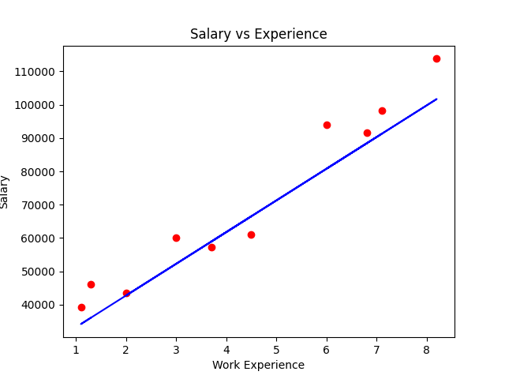

# Salary Prediction using Linear Regression
- Predicts salary based on years of experience.
- Built a **Linear Regression** from scratch using *Numpy*, *Pandas*, *Matplotlib*, **without using scikit-learn's built-in Linear Regression model** *(used only for train-test split)*

## How it works
The model uses Gradient Descent to minimize the loss function.
It updates the weight and bias over 1000 iterations to find the optimal parameters for prediction.

## Key Highlights 
- Implemented linear regression from scratch
- Used gradient descent for optimization
- Did not rely on scikit-learn's built-in model

## Project Structure
```md
|
|--salary_prediction.ipynb  #Main notebook
|--Linear_regression.py     #Linear Regression implementation
|--salary_data.csv          #Dataset
|--image.png                #Visualization
|--README.md                #Documentation
```   

## Tech Stack
1. Programming language: Python
2. Libraries: NumPy, Pandas, Matplotlib, scikit-learn
3. Environment: Jupyter Notebook

## Setup
```bash
pip install numpy pandas matplotlib scikit-learn
```

## How to Run
1. Download or clone this repository
2. Open `salary_prediction.ipynb`
3. Run all cells
4. View the results

## Output
- Predicts salary based on years of experience
- Visualizes regression line using Matplotlib
## Visualization


## Future Improvements
- Add evaluation metrics like MSE and R² Score